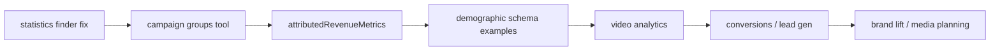

# LinkedIn MCP — Analytics Product Roadmap

Roadmap for expanding Jumon’s LinkedIn connector so AI agents can build complete performance reports (e.g. Understory-style WoW) without relying on Campaign Manager screenshots.

**Related code:** `internal/provider/linkedin/`  
**LinkedIn docs:** [Ads reporting](https://learn.microsoft.com/en-us/linkedin/marketing/integrations/ads-reporting/ads-reporting) · [Metrics schema](https://learn.microsoft.com/en-us/linkedin/marketing/integrations/ads-reporting/ads-reporting-schema)

---

## Current state (shipped)

| MCP tool | API path | Role |
|----------|----------|------|
| `linkedin_list_ad_accounts` | `adAccounts` | Account discovery |
| `linkedin_get_campaigns` | `adAccounts/{id}/adCampaigns` | Campaign structure (auto-pagination) |
| `linkedin_get_campaign_groups` | `adAccounts/{id}/adCampaignGroups` | Campaign group / funnel hierarchy (auto-pagination) |
| `linkedin_get_ad_analytics` | `adAnalytics` (`q=analytics` or `q=statistics`) | Primary performance metrics |
| `linkedin_search_creatives` | `adAccounts/{id}/creatives` | Creative metadata + feedUrl/previewUrl enrichment |

**Recent improvements**

- Campaign list pagination — no 100-campaign silent truncation
- Analytics rows include `pivotValues` (campaign/creative IDs)
- Delivery metrics: `approximateMemberReach`, auto-requested `impressions`, derived `averageFrequency`
- Schema metric catalog + report-oriented `fields` examples for agent discoverability

**Design principle:** Agents request metrics via the `fields` parameter (any valid LinkedIn field name, max 20 per request). The connector does not return “all metrics” in one call; schemas document what to ask for.

---

## P0 — Highest priority

### Fix / support `statistics` finder on `linkedin_get_ad_analytics`

- [x] **API:** Same `GET /adAnalytics`, `q=statistics`
- [x] **Value:** Up to **three pivots** in one request (e.g. `CAMPAIGN` + `PLACEMENT_NAME`)
- [x] **Work:** Send `pivots=List(...)` (plural) instead of `pivot=` when `finder_type` is `statistics`
- [x] **Effort:** Low (extend existing tool)

### `linkedin_get_campaign_groups`

- [x] **API:** `adAccounts/{id}/adCampaignGroups`
- [x] **Value:** Map report sections (TOFU / MOFU / BOFU) to LinkedIn hierarchy; power `campaign_group_ids` filters on analytics
- [x] **Effort:** Low–medium (mirror `linkedin_get_campaigns` patterns: search, pagination, filters)

---

## P1 — High value

### `attributedRevenueMetrics` finder

- [x] **API:** `adAnalytics`, `q=attributedRevenueMetrics`
- [x] **Value:** CRM-attributed metrics — `revenueWonInUsd`, `returnOnAdSpend`, open/closed opportunities
- [x] **Work:** Document in schema; verify `finder_type` + field names; test with CRM-linked accounts
- [x] **Effort:** Low (existing tool, new finder)
- **Note:** Requires LinkedIn CRM revenue attribution setup for the account

### Demographic pivots (documentation + examples)

- [x] **API:** Same `adAnalytics`, pivots like `MEMBER_COMPANY_SIZE`, `MEMBER_INDUSTRY`, `MEMBER_SENIORITY`, `MEMBER_JOB_TITLE`, etc.
- [x] **Value:** Professional demographic breakdowns in reports
- [x] **Work:** Schema examples for demographic reports; note reach metrics are **not** available on `MEMBER_*` pivots
- [x] **Effort:** Low (mostly schema / agent guidance)

---

## P2 — Medium value (completed)

### `linkedin_get_video_analytics`

- **Deferred:** Requires `r_organization_social` scope beyond current Jumon grant. Will be revisited if scope is expanded.

### Conversion rules & conversion performance

- [x] **Tool:** `linkedin_list_conversions` — fetches named conversion rules via `GET /rest/conversions?q=account`; optional `enabled_only` filter
- [x] **Performance workflow:** Call `linkedin_list_conversions` for rule names, then use `linkedin_get_ad_analytics` with `externalWebsiteConversions`, `externalWebsitePostClickConversions`, `externalWebsitePostViewConversions`, `conversionValueInLocalCurrency` pivoted by `CAMPAIGN` or `CREATIVE`
- [x] **Scope:** `r_ads`

### Lead Gen Forms — enrichment + discovery

- [x] **Tool:** `linkedin_list_lead_forms` — account-wide discovery via `GET /rest/leadForms?q=owner`
- [x] **Enrichment on `linkedin_search_creatives` / `linkedin_get_creative`:** adds `leadFormUrn`, `leadFormCtaLabel`, `leadFormName` when the creative has a `leadgenCallToAction` (batch-resolved; flag `include_lead_form_details`, default true)
- [x] **Scope:** `r_ads`

### Structure helpers

| Tool | API | Status |
|------|-----|--------|
| `linkedin_get_campaign` | `adAccounts/{id}/adCampaigns/{campaignId}` | [x] shipped |
| `linkedin_get_creative` | `adAccounts/{id}/creatives/{creativeUrn}` | [x] shipped (feedUrl, previewUrl, leadForm fields, optional thumbnailUrl) |

### Creative feed, preview, and asset links

- [x] **feedUrl + previewUrl** — shipped; `include_preview_urls` default true (opt-out)
- [x] **Lead gen fields** — `leadFormUrn`, `leadFormCtaLabel`, `leadFormName`; default true; batch-deduplicated
- **thumbnailUrl (blocked by scope):** `GET /rest/posts/{urn}` is not accessible under `r_ads` alone (confirmed via spike on account 512247261, May 2026). The `include_asset_urls` flag (default false) degrades silently. Will be re-enabled when `r_organization_social` or equivalent scope is available.
---

## P3 — Lower priority / niche

### Brand Lift Testing

- **API:** [Ad Lift Tests](https://learn.microsoft.com/en-us/linkedin/marketing/integrations/experimentation/brand-lift-testing/ad-lift-tests) · [Ad Lift Test Results](https://learn.microsoft.com/en-us/linkedin/marketing/integrations/experimentation/brand-lift-testing/ad-lift-test-results)
- **Value:** Lift studies (absolute lift, cost per lifted member, confidence intervals)
- **Use case:** Brand studies — **not** weekly WoW campaign tables
- **Effort:** Medium

### Media Planning API

- **API:** [Media Planning API](https://learn.microsoft.com/en-us/linkedin/marketing/media-planning/media-planning-api)
- **Value:** **Forecasts** (reach, frequency, CPM, CPL) — planning, not historical reporting
- **Effort:** Medium–high

### Community / organic analytics

- Post / share statistics, member creator analytics
- **Note:** Different permissions (`r_organization_*`, community management); separate product surface from Campaign Manager ads reporting
- **Effort:** High; only if product expands beyond paid ads

---

## Explicitly out of scope (for standard WoW reports)

Most Understory-style weekly metrics already map to **`adAnalytics`** with the right `fields`:

| Report need | LinkedIn field(s) |
|-------------|-------------------|
| Reach | `approximateMemberReach` |
| Average frequency | Derived: `impressions / approximateMemberReach` (connector adds `averageFrequency`) |
| Audience penetration | `audiencePenetration` |
| Spend | `costInLocalCurrency` |
| Engagements | `totalEngagements`, `likes`, `comments`, … |
| Video | `videoViews`, quartile fields |
| Website visits | `landingPageClicks`, `clicks` |
| Lead gen | `oneClickLeads`, `qualifiedLeads`, … |
| Convo / InMail | `sends`, `opens`, `actionClicks` |

**Operational gaps (not new endpoints)**

- **Understory shorthand names** — mapping layer on top of LinkedIn campaign names
- **Multiple ad accounts** (e.g. main + Media Credit) — one analytics call per `account_id`
- **WoW** — two date-range calls + `time_granularity: ALL` (do not sum daily reach)

---

## Permissions & prerequisites

| Capability | Typical permission / requirement |
|------------|--------------------------------|
| Ads reporting | `r_ads_reporting` |
| Account / campaign read | `r_ads` (via Jumon OAuth connection) |
| CRM revenue metrics | CRM linked in LinkedIn + `attributedRevenueMetrics` finder |
| Brand lift | Brand lift product access |
| Video analytics | Verify scope for `videoAnalytics` vs ads reporting |

Confirm LinkedIn app approved products and scopes before shipping new tools.

---

## Suggested implementation order

1. **P0** — `statistics` finder + campaign groups  
2. **P1** — Revenue finder + demographic report examples  
3. **P2** — Video analytics, conversions, lead gen, structure helpers  
4. **P3** — Brand lift, media planning, organic (if product requires)

---

## Success criteria

- [ ] Agent can build a full WoW report for a connected account using MCP only (no screenshots for standard delivery/performance metrics)
- [ ] Campaign group → campaign → metrics hierarchy is navigable via tools
- [ ] Reach, frequency, penetration, spend, engagements, video, leads, and messaging metrics are discoverable from tool schemas
- [ ] Multi-account accounts (e.g. Media Credit) supported via explicit `account_id` per call
- [ ] Documented LinkedIn constraints (92-day reach window, 20 fields per request, `ALL` granularity for weekly totals) visible in schema, not server instructions

---

## References

- [Metrics Available in LinkedIn Ads Reporting](https://learn.microsoft.com/en-us/linkedin/marketing/integrations/ads-reporting/ads-reporting-schema)
- [Delivery metrics in Campaign Manager](https://www.linkedin.com/help/lms/answer/a426154)
- [Integration requirements for reporting](https://learn.microsoft.com/en-us/linkedin/marketing/integrations/ads-reporting/integration-requirements-reporting)
